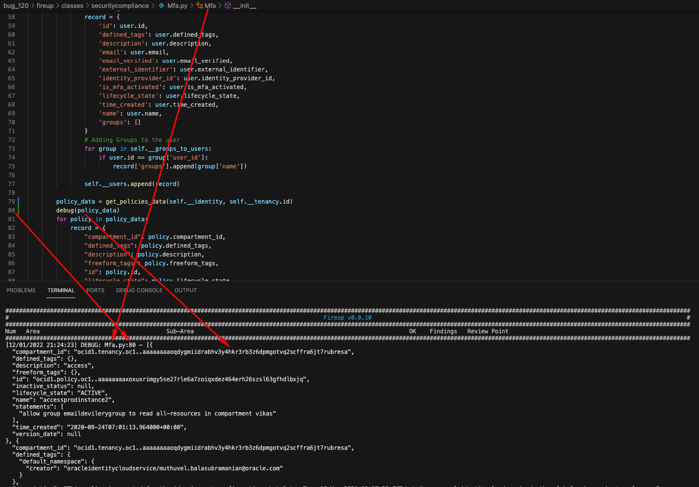

# Table of Contents

- [Table of Contents](#table-of-contents)
  - [Class Structure](#class-structure)
- [Collaboration Guidelines](#collaboration-guidelines)
  - [Get Started](#get-started)
  - [Branch and Collaboration](#branch-and-collaboration)
  - [How Create new review point](#how-create-new-review-point)
  - [How to add debug entries in your code](#how-to-add-debug-entries-in-your-code)
    - [Examples](#examples)
  - [How to add a dependency that I use in my Review Point to the venv being used?](#how-to-add-a-dependency-that-i-use-in-my-review-point-to-the-venv-being-used)
  - [Reading reports](#reading-reports)
  - [Using Parallel Executor](#using-parallel-executor)
    - [What Is It For?](#what-is-it-for)
    - [How Do I Use It?](#how-do-i-use-it)
    - [Common Issues](#common-issues)
    - [Resource Registry](#resource-registry)
  - [Unitary Testing](#unitary-testing)
  - [Github Actions Guidelines](#github-actions-guidelines)
    - [What do I need to do to have a succesful run?](#what-do-i-need-to-do-to-have-a-succesful-run)
    - [Branch Naming Convention](#branch-naming-convention)
  - [Github Best Practices](#github-best-practices)


____

<div id="Class-Structure"></div>

## Class Structure

The following is the class structure applied to the Fireup Tool


The following design patterns are applied to this project: 

- [Abstract Factory Pattern](https://en.wikipedia.org/wiki/Abstract_factory_pattern)
- [Iterator Pattern](https://en.wikipedia.org/wiki/Iterator_pattern)
- [Decorator Pattern](https://en.wikipedia.org/wiki/Decorator_pattern)

# Collaboration Guidelines


<div id="Get-Started"></div>

## Get Started
- Create a staging environment to hold your work. To do so, work in creating a remote machine in your tenant that has a public IP address. 
- Once machine is created, run the [following script](https://github.com/oraclecloudbricks/helper_scripts/blob/main/dev_pivot_setup/setup_pivot.sh) on it. 
- When finished, run the following instructions: 
  
```shell
git config --global user.name "your github user"
git config --global user.email "your email associated to above github user"
```

**WARNING:** Above command is mandatory before start working. Neglecting this step, will mark your commits as user *"Oracle Public Cloud User"* and will break traceability

- Finish the OCI CLI configuration by setting the contents of the file `~/.oci/config` to the following:

```shell
[DEFAULT]
user=ocid1.user.oc1..fooruser
fingerprint=11:32:10:d8:52:43:dd:86:0a:04:0f:47:23:be:72:70
tenancy=ocid1.tenancy.oc1..bartenancy
region=re-region-1
key_file=/foo/bar/path/api_private_key.pem
```

**Note:**
- The content of above file should be replaced with what applies to your user. Do not copy this as-is. 
- The data requested is:
  - user: Your OCI User OCID
  - fingerprint: The fingerprint associated to the private API Key imported in your user. This is unique to you and it must be imported in the OCI CLI. 
  - tenancy: Your OCI Tenancy OCID
  - region: The region where your tenancy is located
  - key_file: Absolute Path to the private API Key imported in your user. This is unique to you and it must be imported in the OCI CLI.

- Put your associated private SSH key in github under `/home/opc/.ssh/id_rsa` to be able to pull and push code to github. If you don't do this, you will get a permissions error when trying to clone, push or pull code to github as depicted in below screenshot: 
  


<div id="BranchAndCollaboration"></div>

## Branch and Collaboration

- In order to collaborate:
  - Open new issue on [GitHub Fireup repo](https://github.com/oraclecloudbricks/fireup/issues). If not create a new Issue.
  - **Note**: Asume that if no Issue is created, nobody is working on issue you have selected.
  - Branch out the respository into your own personal branch
    - Branch out depending on what kind of issue you are dealing      
      - To create a new branch:
        - Clone the repository in a fresh new directory by executing `git clone git@github.com:oraclecloudbricks/fireup.git`
        - Make sure you have the latest and greatest updates from main branch. To do so, execute: 
            `git branch`
            This should return something like this: 

            ```shell
            [opc@dalquintdevhubscl fireup]$ git branch
              * main
            ```
          - If the asterisc is on main, then do pull by executing `git pull`
          - Then create your branch by executing `git checkout -b branch_name`
            -  If this is a new review point being introduced, branch creation should follow this naming convention
          - `feature/review_point_name`          
        - If this is a bug report, branch creation should follow this naming convention
          - `bug/bug_report_number`
        - **At this point and this point only, you can start working on your code**
      - Start working on your code and upon first commit, execute the following command to create the remote branch on github `git push --set-upstream origin foo/bar_x_y` where `foo/bar_x_y` is either your feature or bug.
      - The expected output is something similar to this:
  
```shell
Enumerating objects: 5, done.
Counting objects: 100% (5/5), done.
Delta compression using up to 2 threads
Compressing objects: 100% (3/3), done.
Writing objects: 100% (3/3), 734 bytes | 734.00 KiB/s, done.
Total 3 (delta 2), reused 0 (delta 0), pack-reused 0
remote: Resolving deltas: 100% (2/2), completed with 2 local objects.
remote: 
remote: Create a pull request for 'foo/bar_x_y' on GitHub by visiting:
remote:      https://github.com/oraclecloudbricks/fireup/pull/new/foo/bar_x_y
remote: 
To github.com:oraclecloudbricks/fireup.git
 * [new branch]      foo/bar_x_y -> foo/bar_x_y
Branch 'foo/bar_x_y' set up to track remote branch 'foo/bar_x_y' from 'origin'.
```

- From here on, all subsequent pushes, will go to the remote branch. Above task is only **executed once***
  
    - Upon first commit, reference the issue number for tracking. You should do this by running the following set of commands: 
  
  ```shell
  git add .
  git commit -m "Here add a very detailed description of what you are doing. Finish with Ref: https://github.com/oraclecloudbricks/fireup/issues/XX" where XX is the issue number
  git push 
  ```
    - Once feature or bug is completed, code a unitary testing suite. Refer to [this part of the document](#UnitTesting) to understand how to do it. 
- Create a Pull request against main branch on fireup repository
    - Always mark your PR with the approriate labels for tracking
    - Request review from `dralquinta`  
    - **IMPORTANT** 
      - **NEVER COMMIT TO MAIN BRANCH ON PRIMARY REPOSITORY**
      - **NEVER MERGE CODE. ONLY PROJECT LEAD CAN MERGE AND RELEASE CODE**
      - **ON EACH NEW PULL REQUEST INCLUDE THE RESULTS OF THE UNITARY TEST**


If code is successfull, then PR will be approved and later merged into main
If code contains bugs or enhancements, then PR will be returned to owner for fixing


<div id="CreatingReviewPoint"></div>

## How Create new review point

- Locate the review point to create in sprint spreadsheet
- Check if the review point is already being worked in an issue declared under the [following link](https://github.com/oraclecloudbricks/fireup/issues) 
- Update the dictionary entry on static definition under [statics.py](./common/utils/statics/Statics.py)

    For example: 
     - Review point 1.1: 
  
        ```python
        __rp_X_Y = {
           'entry': '1.1',
            'area': 'Security and Compliance',
            'sub_area': 'Manage Identities and Authorization Policies',
            'review_point': 'Enforce the Use of Multi-Factor Authentication (MFA)',
            'success_criteria': 'Check that MFA is enabled on all users',    
            'fireup_items': 'Fireup Tasks: X - Foobarbar'
            }
        ```
- Upon each review, you must do the mapping between the best practices framework and Fireup Tasks
- Create a new Concrete Class for review point under the framework structure under `classes > main_area > class`

- Once done, update the [following link](https://confluence.oraclecorp.com/confluence/pages/editpage.action?pageId=3393323583) in confluence, with the Class Mapping and Fireup Mapping
    For example: 
    - Review point 1.1

        - Create class Mfa.py under path [classes > securitycompliance > Mfa.py](./classes/securitycompliance/Mfa.py)

- Concrete class content should look like this: 

```python
 Copyright (c) 2021 Oracle and/or its affiliates.
# All rights reserved. The Universal Permissive License (UPL), Version 1.0 as shown at http://oss.oracle.com/licenses/upl
# NameOfFile.py
# Description: Class Description

from common.utils.helpers.helper import *
from common.utils.formatter.printer import debug_with_date, print_with_date
from classes.abstract.ReviewPoint import ReviewPoint
from common.utils.tokenizer import *
import oci


class Mfa(ReviewPoint):

    # Class Variables
     # Add here all class variables as follow
     # __class_variable_1  = None
     # __sdk_api_client = None
     # __data_handler = None
     # __tenancy = None


   def __init__(self,
                entry:str, 
                area:str, 
                sub_area:str, 
                review_point: str, 
                status:bool, 
                failure_cause:list, 
                findings:list, 
                mitigations:list, 
                fireup_mapping:list,
                config, 
                signer):
       self.entry = entry
       self.area = area
       self.sub_area = sub_area
       self.review_point = review_point
       self.status = status
       self.failure_cause = failure_cause
       self.findings = findings
       self.mitigations = mitigations
       self.fireup_mapping = fireup_mapping

       # From here on is the code is not implemented on abstract class
       self.config = config
       self.signer = signer
       self.sdk_api_client = get_api_client(self.config, self.signer)  
       ...
       ...
       ...       
       self.__tenancy = get_tenancy_data(self.__identity, self.config)

    def load_entity(self):       
        data_to_analyze = get_data_to_analyze_data(self.__sdk_api_client, other_args, ... , other_args)        
        for iterator in data_to_analyze:
                record = {
                    'foo': bar,
                    'baz': qux,
                    ...
                    ...
                    ...
                    'bar': foo,
                }
                

                self.__data_handler__.append(record)
        return self.__data_handler
                

    def analyze_entity(self, entry):
        self.load_entity()
        dictionary = ReviewPoint.get_benchmark_dictionary(self)
        for data in self.__data_handler:
         # Here apply all the analysis and conditional logic to determine the Failure status of a review point
             
         # Add the following entries to compute a failure scenario    
                dictionary[entry]['status'] = False
                dictionary[entry]['findings'].append(user)
                dictionary[entry]['failure_cause'].append('Enter Here the faulty objects and explain why is a failure')                
                dictionary[entry]['mitigations'].append('Enter here detailed mitigation steps and related object in fault')                                
        return dictionary
```

- Update file classes > main_area > class > README.md with the review point description as follows: 

```shell
# Review Point - Class Mapping

| Review Point | Concrete Class Implementation                           |
|--------------|---------------------------------------------------------|
| 1.1          | [Mfa.py](Mfa.py)                                        |
| 1.2          | [Admin.py](Admin.py)                                    |
| 1.3          | [AdminAbility.py](AdminAbility.py)                      |
| 1.4          | [PolicyAdmin.py](PolicyAdmin.py)                        |
| 1.5          | [FederatedUser.py](FederatedUser.py)                    |
| 1.6          | [ApiKeys.py](ApiKeys.py)                                |
| 1.7          | [CompartmentsAndPolicies.py](CompartmentsAndPolicies.py)|
| 1.8          | [Rbac.py](Rbac.py)                                      |
| 1.9          | [InstancePrincipal.py](InstancePrincipal.py)            |
| X.Y          | [Other.py](Other.py)                                    |
```

**Important Notes**

- You can add as many class variables as required. Always use the convention `__variable_name = FOO` to avoid name conflicts.
- Do not include iteratable objects into `dictionary[entry]['failure_cause'].append()` but only say a statement that generalize the failure.
- You can add as many imports you require on your Concrete class, however mandatory entries are the following: 
```python
from common.utils.helpers.helper import *
from common.utils.formatter.printer import debug_with_date, print_with_date
from classes.abstract.ReviewPoint import ReviewPoint
from common.utils.tokenizer import *
import oci
```
- When calling `self.sdk_api_client = get_api_client(self.config, self.signer)` if the helper class does not contain the required client, add it in the following way under file `common/utils/helpers/helper.py`:

```python
def get_identity_client(config, signer):
    try:
        identity_client = oci.identity.IdentityClient(config, signer=signer)
    except Exception as e:
        raise RuntimeError("Failed to create identity client: {}".format(e))
    return identity_client
```

  - Above example shows the implementation of the identity client as documented on [API reference](https://oracle-cloud-infrastructure-python-sdk.readthedocs.io/en/latest/api/identity/client/oci.identity.IdentityClient.html)
  - For all the list of clients currently available on SDK, refer to the [following link](https://oracle-cloud-infrastructure-python-sdk.readthedocs.io/en/latest/api/landing.html)
  - **Structure of composer should always contain:**
    - Try and except for exception control
    - Representative name of client and then execution of API by using `oci.composer.Client()`
    - All methods should receive as arguments: `config` and `signer=signer` to use CLI Authentication

- Concrete class implementation can contain one or more extra methods, supported by the decorator pattern. A local class function, should always be private and be pre-pended by `__`. Example `def __myPrivatefunction(self, ...)`

- To do the analysis of the information retrieved from API, always use the wrapper extracted object declared as class variable. Never use the direct json object coming from API.  
- Once both abstract methods are implemented, update the [Orchestrate.py](./common/orchestrator/Orchestrate.py)
- Make sure to import your concreteClass into the imports with a class alias
  - The entries on `Orchestrate.py` are the following: 
    - The entry point for execution should follow the naming convention `__call_X_Y`, where `X` and `Y` correspond to the review entry point on dictionary and on spreadsheet
    - The content of the function should always be: 
```python
def __call_X_Y(config, signer, report_directory)
    declaredObject = ConcreteClass(
    Statics.__rp_X_Y['entry'],
    Statics.__rp_X_Y['area'],
    Statics.__rp_X_Y['sub_area'],
    Statics.__rp_X_Y['review_point'],
    True, [], [], [], [], config, signer)
    mitigation_report_name = Statics.__rp_X_Y['entry']+"_"+Statics.__rp_X_Y['area']+"_"+Statics.__rp_X_Y['sub_area']+"_mitigations"
    __dictionary = declaredObject.analyze_entity(Statics.__rp_X_Y['entry'])
    generate_on_screen_report(__dictionary, report_directory, Statics.__rp_X_Y['entry'])
    generate_mitigation_report(__dictionary, report_directory, mitigation_report_name, Statics.__rp_X_Y['fireup_items'])

``` 

Example: 
```python
def __call_1_1(config, signer, report_directory):       
    mfa = Mfa(
    Statics.__rp_1_1['entry'], 
    Statics.__rp_1_1['area'], 
    Statics.__rp_1_1['sub_area'], 
    Statics.__rp_1_1['review_point'],     
    True, [], [], [], [], config, signer)
    mitigation_report_name = Statics.__rp_1_1['entry']+"_"+Statics.__rp_1_1['area']+"_"+Statics.__rp_1_1['sub_area']+"_mitigations"
    __mfa_dictionary = mfa.analyze_entity(Statics.__rp_1_1['entry'])       
    generate_on_screen_report(__mfa_dictionary, report_directory, Statics.__rp_1_1['entry'])    
    generate_mitigation_report(__mfa_dictionary, report_directory, mitigation_report_name, Statics.__rp_1_1['fireup_items'])

```
   
   - Update function `main_orchestrator()` as follows:

```python
  def main_orchestrator(config,signer, report_directory):
    print_header("Fireup "+statics.__version__)
    print_report_sub_header()

    orchestrated_list = [   __call_1_1,
                            __call_1_2,
                            __call_1_3,
                            __call_1_4,
                            __call_1_5,
                            __call_1_6,
                            __call_1_7,
                            ...
                            ...
                            ...
                            __call_X_Y]
    
```

- Update the import to include your concrete class

```python
from classes.reviewarea.ConcreteClass import ConcreteObject 

```
<div id="AddDebugInYourCode"></div>

## How to add debug entries in your code

Ever so often you want to debug stuff in your code so it shows you the details on the console right out of the console. In order to do so, use the function `debug()` as follows:

- Call debug with just a string or object: 
  - `debug("This is a debug string")`
  - `debug(my_object)`
    - **NOTE**: Default color is `white`
- Call debug with a string or an object, but adding a color to the output
  - `debug("This is a debug string", "green")`
  - `debug(my_object, "green")`
    - **NOTE**: The following colors are currently supported: 
      - red
      - green
      - yellow
      - blue
      - magenta
      - cyan
      - grey

### Examples

- The following is the `debug` output that will come by default, exposing the contents of a dataframe coming straight from the API:




- The following is the debug output that will appear when using the `debug` function with a color, in this case `green`, exposing the contents of a dataframe coming straight from the API:


<div id="AddCodeLibDependency"></div>

## How to add a dependency that I use in my Review Point to the venv being used?

Often in your code, you will need to use a library that is not available by default on the environment. This project makes heavy usage of virtual environment (venv) to make sure that all the runs are consistent and isolated from the host environment. 

In order to add a dependency to your venv, follow these steps: 

- Go to file [`common/bash/dependencies.sh`](./common/bash/dependencies.sh)
- Go to part `Installing app dependencies` and add `pip3 install YOUR_DEPENDENCY_NAME`


<div id="ReadingReports"></div>

## Reading reports

When you are creating the reports using something like this: (example from review point 2.9 [CIDRSize.py](https://github.com/oraclecloudbricks/fireup/blob/main/classes/reliabilityresilience/CIDRSize.py))
```python
dictionary[entry]['status'] = False
dictionary[entry]['findings'].append(vcn)
dictionary[entry]['failure_cause'].append('VCNs CIDR Blocks are too small, making it harder to expand.')
dictionary[entry]['mitigations'].append('Make sure vcn '+str(vcn['display_name'])+' CIDR block(s) are at least /24 or bigger.')
```

You will want to be able to look at the outputted data to check that its in a readable format.

To do this, run the command:
```shell
tar -xvf reports.tar.gz
```

This will unpack the reports into the `./reports` directory. You should be able to see the outputted csv and log file that your review point has generated. For a reference of what these should look like, you can look at previous review points outputs.


<div id="UsingParallelExecutor"></div>

## Using Parallel Executor

### What Is It For?

The parallel executor is not always going to be necessary with every review point. 

However, when needing all of a specific resource, a parallel executor is likely to be needed.

The example I will use here is related to review point 2.9 [CIDRSize.py](https://github.com/oraclecloudbricks/fireup/blob/main/classes/reliabilityresilience/CIDRSize.py).

Within this example, I needed to retrieve every VCN from the tenancy. To do this I needed to use the `VirtualNetworkClient.list_vcns(compartment_id)` API call.

As you can see, this method requires a `VirtualNetworkClient` and `compartment_id` to retrieve the data necessary. The thing that makes this complicated is that a client is region specific. This means that the method needs to be run in every compartment within each region. At the time of writing, the `ecrcloud` tenancy is subscribed to `18` regions and has `~160` compartments. This means almost `3000` API calls are necessary to check for all VCNs.

Doing these API calls consecutively takes about `10 minutes`! This is far too long.

The parallel executor was built to tackle this problem and reduces the fetching process to takes anywhere between `10-30 seconds`.

### How Do I Use It?

The parallel executor is surprisingly simple to work with, once you get an understanding of how it works.

Place this at the top with the other imports:

```python
import common.utils.helpers.ParallelExecutor as ParallelExecutor
```

The next step is to create all the clients that you are going to require. This can be done as follows:

```python
# Get all the regions using a helper method
regions = get_regions_data(self.__identity, self.config)
network_clients = []

for region in regions:
    # Clone the config used for creation of clients
    region_config = self.config
    # Modify the region in the config for each region
    region_config['region'] = region.region_name
    # Create a network client for each region
    network_clients.append(get_virtual_network_client(region_config, self.signer))
```
*Note that this is extracted from review point 2.9 [CIDRSize.py](https://github.com/oraclecloudbricks/fireup/blob/main/classes/reliabilityresilience/CIDRSize.py) but with additional comments.*

Next you need whatever you will be looping through. More often than not, this is the compartments and can be retrieved as follows:

```python
# Get all compartments including root compartment
self.__compartments = get_compartments_data(self.__identity, self.__tenancy.id)
self.__compartments.append(get_root_compartment_data(self.__identity, self.__tenancy.id))
```
*Note: If you don't need the root compartmewnt for whatever reason, omit the second line.*

Now we can actually retrieve the data we need with `ParallelExecutor.executor`.

This method is strucutered as follows:<br>
*Note: You don't need to read all the comments here and understand the exact inner workings of this function. However, this will help you know exactly what you're interfacing with in the event you have any errors.*

```python
def executor(dependent_clients:list, independent_iterator:list, fuction_to_execute, threads:int, data_variable):
    # The `values` variable is assigned with the global variable in the file
    values = data_variable
    # If there is already data within the variable, the data can immediately be returned
    if len(values) > 0:
        return values

    items = []
    # This nested for loop seperates each of the `dependent_clients` and `independent_iterators`
    # into a structure that the threads can work on. This looks like this example:
    # [[client1, compart1, compart2, ... compart20], [client2, compart21, compart22, ... compart40] ...]
    # This essetialy maps each client to each and every compartment, but in smaller blocks of 20
    # rather than making each client check every compartment in the tenancy - allowing for concurrency.
    for client in dependent_clients:
        item = [client]
        for i, independent in enumerate(independent_iterator):
            item.append(independent)
            if i > 0 and i % 20 == 0:
                items.append(item)
                item = [client]
        items.append(item)
    # This is where the threads are spun up
    with futures.ThreadPoolExecutor(threads) as executor:
        # A list of processes is made, running a function with each of the items as described above
        # the function that is executed will be explained below
        processes = [
            executor.submit(fuction_to_execute, item) 
            for item in items
        ]
        # Wait for all threads to finish
        futures.wait(processes)
        # Extract all of the data from threads into a single array
        for p in processes:
            for value in p.result():
                values.append(value)
    # return all retrieved values
    return values
```

Before creating function call below, you will need to check [ParallelExecutor.py](https://github.com/oraclecloudbricks/fireup/blob/main/common/utils/helpers/ParallelExecutor.py)

You will want to look for a variable that stores the objects (at the top of the file) and a method that already gets the VCN objects. If there is no evidence the resource has been retrieved before, you will need to create a new variable and method.

In your class:
```python
self.__vcn_objects = ParallelExecutor.executor(network_clients, compartments, ParallelExecutor.get_vcns_in_compartments, len(compartments), ParallelExecutor.vcns)
```

In [ParallelExecutor.py](https://github.com/oraclecloudbricks/fireup/blob/main/common/utils/helpers/ParallelExecutor.py):<br>
Add something like this to the top of the file along with the other variables:
```python
### CIDRSize.py Global Variables
# VCN list for use with parallel_executor
vcns = []
```

Add something like this to the bottom of the file along with the other functions:
```python
def get_vcns_in_compartments(item):
    # Pull out the client that you need as well as the list of compartments from the passed item
    network_client = item[0]
    compartments = item[1:]

    vcns = []
    # Loop through each compartment and run the get_vcn_data function
    # in the compartment. Then loop through the list of returned VCNs,
    # if they are not terminated, add them to the list, that is then returned.
    for compartment in compartments:
        vcn_data = get_vcn_data(network_client, compartment.id)
        for vcn in vcn_data:
            if "TERMINATED" not in vcn.lifecycle_state:
                vcns.append(vcn)

    return vcns
```
*Note: You will need to create the helper function (`get_vcn_data` in this example) in [helper.py](https://github.com/oraclecloudbricks/fireup/blob/main/common/utils/helpers/helper.py) if it doesn't already exist.*

That is now a complete example on how to get all the objects of a specific resource.

Once retrieved, you can modify these objects into a dictionary however you please.

**Important Note: If you need to use these objects again in another parallel executor call, DO NOT modify them. Pass the objects as is and then modify the returned values. This is essential so that the objects are kept general and can be used again anywhere that they are needed.**

If anything I've said in this section isn't clear, please reach out to me on slack if you are internal, and/or mention me in your GitHub issue with `@Matt-Mcl`.


### Common Issues

**This issue is involved with using already retrieved data to get further data in parallel executor**

Exception: `AttributeError: 'tuple' object has no attribute 'foo_bar_list'`

Example: 
```bash
Traceback (most recent call last):
  File "fireup.py", line 42, in <module>
    __main__()
  File "fireup.py", line 39, in __main__
    __exec_orchestrator()   
  File "fireup.py", line 34, in __exec_orchestrator
    main_orchestrator(config, signer, cmd.report_directory)
  File "/home/opc/REPOS/OCIBE/FIREUP/rp_1_12_UPDATED/fireup/common/orchestrator/Orchestrate.py", line 50, in main_orchestrator
    __call_1_12(config, signer, report_directory)
  File "/home/opc/REPOS/OCIBE/FIREUP/rp_1_12_UPDATED/fireup/common/orchestrator/Orchestrate.py", line 210, in __call_1_12
    __instancePrincipal_dictionary = dbSystem.analyze_entity(Statics.__rp_1_12['entry'])
  File "/home/opc/REPOS/OCIBE/FIREUP/rp_1_12_UPDATED/fireup/classes/securitycompliance/DBSystemControl.py", line 149, in analyze_entity
    self.load_entity()    
  File "/home/opc/REPOS/OCIBE/FIREUP/rp_1_12_UPDATED/fireup/classes/securitycompliance/DBSystemControl.py", line 92, in load_entity
    self.__autonomous_database_objects = ParallelExecutor.executor(db_system_clients, self.__compartments, ParallelExecutor.get_autonomous_databases, len(self.__compartments), ParallelExecutor.autonomous_databases)
  File "/home/opc/REPOS/OCIBE/FIREUP/rp_1_12_UPDATED/fireup/common/utils/helpers/ParallelExecutor.py", line 108, in executor
    for value in p.result():
  File "/usr/lib64/python3.6/concurrent/futures/_base.py", line 425, in result
    return self.__get_result()
  File "/usr/lib64/python3.6/concurrent/futures/_base.py", line 384, in __get_result
    raise self._exception
  File "/usr/lib64/python3.6/concurrent/futures/thread.py", line 56, in run
    result = self.fn(*self.args, **self.kwargs)
  File "/home/opc/REPOS/OCIBE/FIREUP/rp_1_12_UPDATED/fireup/common/utils/helpers/ParallelExecutor.py", line 538, in get_autonomous_databases
    autonomous_databases_data = get_auto_db_data(database_client, compartment.id)
  File "/home/opc/REPOS/OCIBE/FIREUP/rp_1_12_UPDATED/fireup/common/utils/helpers/helper.py", line 357, in get_auto_db_data
    database_client.list_autonomous_databases,
AttributeError: 'tuple' object has no attribute 'list_autonomous_databases'
```

*Reason:*

This will happen when creating a list of clients that also includes the region like so:

```python
regions = get_regions_data(self.__identity, self.config)

mysql_clients = []

for region in regions:
  region_config = self.config
  region_config['region'] = region.region_name
  mysql_clients.append( (get_mysql_client(region_config, self.signer), region.region_name, region.region_key.lower()) )
```

This error is then thrown because the parallel executor is called with the list of tuples in the client list.

```python
self.__mysql_database_objects = ParallelExecutor.executor(mysql_clients, self.__compartments, ParallelExecutor.get_mysql_dbs, len(self.__compartments), ParallelExecutor.mysql_dbsystems)
```

*Solution:*

Make sure to call the parallel executor function with the correct client list as below. This just extracts the clients, which is all that is needed in general cases.

```python
self.__mysql_database_objects = ParallelExecutor.executor([x[0] for x in mysql_clients], self.__compartments, ParallelExecutor.get_mysql_dbs, len(self.__compartments), ParallelExecutor.mysql_dbsystems)
```

The reason why you would want the regions as well is when doing something like so:

```python
self.__mysql_full_objects = ParallelExecutor.executor(mysql_clients, self.__mysql_database_objects, ParallelExecutor.get_mysql_dbsystem_full_info, len(self.__mysql_database_objects), ParallelExecutor.mysql_full_data)
```

This example requires you to pass in the MySQL objects again, in order to retrieve additional data about them. This needs the region because only the client which shares the same region that the MySQL database is located in can be used, otherwise errors are thrown due to the resource not being present. 

These regions are then used within a function in [ParallelExecutor.py](https://github.com/oraclecloudbricks/fireup/blob/main/common/utils/helpers/ParallelExecutor.py) like below. This function looks very similar to that in [How Do I Use It?](#how-do-i-use-it) section, but with a key difference.

```python
def get_mysql_dbsystem_full_info(item):
  # Here the client is extracted like normal, but this time it's a tuple in the form:
  # (database_client:DatabaseClient, region_name:string, region_key:string)
  # as made by the loop earlier to create the list of clients.
  database_client = item[0]
  mysql_dbs = item[1:]

  mysql_full_data = []

  for mysql_db in mysql_dbs:
    # Here the region in extracted from the OCID of the MySQL database. 
    # Any regional resource will contain the region in the OCID as it looks like so:
    # ocid1.mysqldbsystem.oc1.uk-london-1.aaaaaaaaetc
    region = mysql_db.id.split('.')[3]
    # A check is then made to see whether the region of the database client matches the MySQL database.
    # If either the region name in index 1 (e.g. uk-london-1) or region key in index 2 (e.g. phx) is in the id, the data can be retrieved.
    if database_client[1] in region or database_client[2] in region:
      # Index 0 has been used here to reference the client in the passed in tuple
      db = database_client[0].get_db_system(mysql_db.id).data
      if db.lifecycle_state != "DELETED":
        mysql_full_data.append(db)

  return mysql_full_data
```

### Resource Registry

This section details all the resources currently being pulled within [ParallelExecutor.py](https://github.com/oraclecloudbricks/fireup/blob/main/common/utils/helpers/ParallelExecutor.py). 

| Variable Name                       | Method Name                                | Notes                                                                                                                                                                   |
|-------------------------------------|--------------------------------------------|-------------------------------------------------------------------------------------------------------------------------------------------------------------------------|
| availability_domains                | get_availability_domains                   
| security_lists                      | get_security_lists                         
| steering_policies                   | get_steering_policies                      
| vcns_in_multiple_regions            | check_vcns_in_multiple_regions             | Contains a boolean of whether there are VCNs in multiple regions of the tenancy. See RP 3.5 for example.
| oke_clusters                        | get_oke_clusters                           
| drgs                                | get_drgs                                   
| drg_attachment_ids                  | get_drg_attachment_ids                     
| drg_attachments                     | get_drg_attachments                        
| service_gateways                    | get_service_gateways                       
| local_peering_gateways              | get_local_peering_gateways                 
| virtual_circuits                    | get_virtual_circuits                       
| bucket_lifecycle_policies           | get_bucket_lifecycle_policies              
| limit_values_with_regions           | get_limit_values                           | This method returns a tuple with (region, service name and limit value object)
| limit_availabilities_with_regions   | get_limit_availabilities                   | This method returns a tuple with (region, service name and limit value object, resource availability object). This was necessary to keep context of the availabilities.
| alarms                              | get_alarms                                 
| metrics                             | get_metrics                                
| vcns                                | get_vcns_in_compartments                   
| load_balancers                      | get_load_balancers                         
| network_load_balancers              | get_network_load_balancers                 
| load_balancer_healths               | get_load_balancer_healths                  
| network_load_balancer_healths       | get_load_balancer_healths                  | Uses the same as above, but filters by id to get network over regular load balancers.
| policies                            | get_policies                               
| users_with_api_keys                 | get_user_with_api_keys                     
| block_volumes                       | get_block_volumes                          
| boot_volumes                        | get_boot_volumes                           
| storages_with_no_policy             | get_block_storages_with_no_policy          
| file_systems                        | get_file_systems                           
| file_systems_with_no_snapshots      | get_file_systems_with_no_snapshots         
| mount_targets                       | get_mounts                                 
| export_options                      | get_export_options                         
| db_system_homes                     | get_database_homes                         
| mysql_dbsystems                     | get_mysql_dbs                              
| db_systems_with_no_backups          | get_db_systems_with_no_backups             
| mysql_dbs_with_no_backups           | get_mysql_dbs_with_no_backups              
| instances                           | get_instances                              
| subnets                             | get_subnets_in_compartments                
| oracle_dbsystems                    | get_database_systems                       
| mysql_full_data                     | get_mysql_dbsystem_full_info               
| block_volume_replicas               | get_block_volume_replicas                  
| boot_volume_replicas                | get_boot_volume_replicas                   
| buckets                             | get_buckets                                
| autonomous_databases                | get_autonomous_databases                   
| adb_nsgs                            | get_adb_nsgs                               
| bucket_preauthenticated_requests    | get_preauthenticated_requests_per_bucket   
| oracle_dbsystems_applicable_patches | get_database_home_patches                  
| oracle_db_home_patch_history        | get_database_homes_applied_patch_history   
| oracle_db_system_patch_history      | get_database_systems_applied_patch_history 
| service_connectors                  | get_service_connectors_info                
| bucket_retention_rules              | get_bucket_retention_rules_info            
| autoscaling_configurations          | get_autoscaling_configurations             
| instance_pools                      | get_instance_pool   
| compute_instances                   | get_compute_instances                       
| compute_images                      | get_compute_images

<div id="UnitTesting"></div>

## Unitary Testing

***This approach uses Test Driven Development Model, for which an initial successful result in findings needs to be pre-established, so later after module creation, this matches with this value.***

***The test modules are located in the `test` directory***

***The testing process is supported by pytest module***

In order to use test module, follow this methodology: 

- Determine first how many results will return a successful entry point. This value will be knowned as `ASSERTION_VALUE_FOR_CORRECT_RESULTS`
- Once determined, go to directory `test` and inside pertaining directory (see areas) create a test suite file, named `test_suite_X_Y.py` where `X_Y` is the corresponding review point. 
- The content of the file is determined by the following logic: 

File: `test_suite_X_Y.py`

```python
# Copyright (c) 2021 Oracle and/or its affiliates.
# All rights reserved. The Universal Permissive License (UPL), Version 1.0 as shown at http://oss.oracle.com/licenses/upl
# fireup.py
# Description: Main test suite for fireup review tool
# Dependencies: pytest

from os import write
from common.utils.helpers.helper import get_config_and_signer
from common.utils.formatter.printer import debug
from classes.AREA.CONCRETECLASS import ConcreteClass
from common.utils import statics
from common.utils.tokenizer.signer import *

  

def __test_suite_log(capsys):
    out, err = capsys.readouterr()
    open("stderr.out", "w").write(err)
    open("stdout.out", "w").write(out)

def test_review_point(capsys):     
    
    result_dictionary = ConcreteClass(statics.__rp_X_Y['entry'], 
    statics.__rp_X_Y['area'], 
    statics.__rp_X_Y['sub_area'], 
    statics.__rp_X_Y['review_point'], 
    True, [], get_config_and_signer()[0], 
    get_config_and_signer()[1]
    )

    results_in_fault=0
    dictionary = result_dictionary.analyze_entity(statics.__rp_X_Y['entry'])   
    
    for item in dictionary[statics.__rp_X_Y['entry']]['findings']:
        debug(item)
        results_in_fault += 1
    
    assert results_in_fault == ASSERTION_VALUE_FOR_CORRECT_RESULTS


    

    __test_suite_log(capsys)

```

To run the unitary testing, run script `unitary_test.sh`. 

- Expected results under successful test is: 

```shell
[opc@dalquintdevhubscl test]$ ./unitary_test.sh 
========================================================================================================= test session starts ==========================================================================================================
platform linux -- Python 3.6.8, pytest-6.2.5, py-1.11.0, pluggy-1.0.0 -- /home/opc/REPOS/OCIBE/MY_PROJECTS/FIREUP/fireup_doc_bug/fireup/test/venv/bin/python3
cachedir: .pytest_cache
rootdir: /home/opc/REPOS/OCIBE/MY_PROJECTS/FIREUP/fireup_doc_bug/fireup/test
collected 9 items                                                                                                                                                                                                                      

reliabilityresilience/test_suite_2_8.py::test_review_point PASSED                                                                                                                                                                [ 11%]
reliabilityresilience/test_suite_2_9.py::test_review_point PASSED                                                                                                                                                                [ 22%]
securitycompliance/test_suite_1_1.py::test_review_point PASSED                                                                                                                                                                   [ 33%]
securitycompliance/test_suite_1_2.py::test_review_point PASSED                                                                                                                                                                   [ 44%]
securitycompliance/test_suite_1_3.py::test_review_point PASSED                                                                                                                                                                   [ 55%]
securitycompliance/test_suite_1_4.py::test_review_point PASSED                                                                                                                                                                   [ 66%]
securitycompliance/test_suite_1_5.py::test_review_point PASSED                                                                                                                                                                   [ 77%]
securitycompliance/test_suite_1_6.py::test_review_point PASSED                                                                                                                                                                   [ 88%]
securitycompliance/test_suite_1_7.py::test_review_point PASSED                                                                                                                                                                   [100%]

========================================================================================================== slowest durations ===========================================================================================================
19.98s call     reliabilityresilience/test_suite_2_8.py::test_review_point
4.87s call     securitycompliance/test_suite_1_6.py::test_review_point
1.01s call     reliabilityresilience/test_suite_2_9.py::test_review_point
0.86s call     securitycompliance/test_suite_1_4.py::test_review_point
0.86s call     securitycompliance/test_suite_1_2.py::test_review_point
0.82s call     securitycompliance/test_suite_1_7.py::test_review_point
0.36s call     securitycompliance/test_suite_1_1.py::test_review_point
0.33s call     securitycompliance/test_suite_1_5.py::test_review_point
0.28s call     securitycompliance/test_suite_1_3.py::test_review_point

(18 durations < 0.005s hidden.  Use -vv to show these durations.)
========================================================================================================== 9 passed in 32.34s ==========================================================================================================
[opc@dalquintdevhubscl test]$ 

```

- Expected results under failed test is: 

```shell
[opc@dalquintdevhubscl test]$ ./unitary_test.sh 
========================================================================================================= test session starts ==========================================================================================================
platform linux -- Python 3.6.8, pytest-6.2.5, py-1.11.0, pluggy-1.0.0 -- /home/opc/REPOS/OCIBE/MY_PROJECTS/FIREUP/fireup_doc_bug/fireup/test/venv/bin/python3
cachedir: .pytest_cache
rootdir: /home/opc/REPOS/OCIBE/MY_PROJECTS/FIREUP/fireup_doc_bug/fireup/test
collected 9 items                                                                                                                                                                                                                      

reliabilityresilience/test_suite_2_8.py::test_review_point PASSED                                                                                                                                                                [ 11%]
reliabilityresilience/test_suite_2_9.py::test_review_point PASSED                                                                                                                                                                [ 22%]
securitycompliance/test_suite_1_1.py::test_review_point PASSED                                                                                                                                                                   [ 33%]
securitycompliance/test_suite_1_2.py::test_review_point PASSED                                                                                                                                                                   [ 44%]
securitycompliance/test_suite_1_3.py::test_review_point PASSED                                                                                                                                                                   [ 55%]
securitycompliance/test_suite_1_4.py::test_review_point PASSED                                                                                                                                                                   [ 66%]
securitycompliance/test_suite_1_5.py::test_review_point PASSED                                                                                                                                                                   [ 77%]
securitycompliance/test_suite_1_6.py::test_review_point FAILED                                                                                                                                                                   [ 88%]
securitycompliance/test_suite_1_7.py::test_review_point PASSED                                                                                                                                                                   [100%]

=============================================================================================================== FAILURES ===============================================================================================================
__________________________________________________________________________________________________________ test_review_point ___________________________________________________________________________________________________________

capsys = <_pytest.capture.CaptureFixture object at 0x7fa101291cc0>

    def test_review_point(capsys):
    
        result_dictionary = ApiKeys(Statics.__rp_1_6['entry'],
        Statics.__rp_1_6['area'],
        Statics.__rp_1_6['sub_area'],
        Statics.__rp_1_6['review_point'],
        True, [], [], [], [],
        get_config_and_signer()[0],
        get_config_and_signer()[1]
        )
    
        results_in_fault=0
        dictionary = result_dictionary.analyze_entity(Statics.__rp_1_6['entry'])
    
        for item in dictionary[Statics.__rp_1_6['entry']]['findings']:
            debug_with_date(item)
            results_in_fault += 1
    
>       assert results_in_fault == 22
E       assert 21 == 22
E         +21
E         -22

securitycompliance/test_suite_1_6.py:39: AssertionError
--------------------------------------------------------------------------------------------------------- Captured stdout call ---------------------------------------------------------------------------------------------------------
[02/12/2021 20:17:37] DEBUG: {'id': 'ocid1.user.oc1..aaaaaaaa6lvil5xcpovritobe5xhfbgw3ld5bwbkizxmsmeqjtvxzxqx3hmq', 'defined_tags': {}, 'description': 'awesome_user', 'email': None, 'email_verified': False, 'external_identifier': None, 'identity_provider_id': None, 'is_mfa_activated': False, 'lifecycle_state': 'ACTIVE', 'time_created': datetime.datetime(2021, 7, 23, 5, 39, 44, 274000, tzinfo=tzutc()), 'name': 'awesome_user', 'api_key': [{'fingerprint': '03:08:7d:45:76:f7:f3:be:3a:da:bb:ed:5c:01:f4:0c', 'inactive_status': None, 'lifecycle_state': 'ACTIVE', 'user_id': 'ocid1.user.oc1..aaaaaaaa6lvil5xcpovritobe5xhfbgw3ld5bwbkizxmsmeqjtvxzxqx3hmq', 'time_created': datetime.datetime(2021, 7, 23, 5, 40, 54, 806000, tzinfo=tzutc())}]}
[02/12/2021 20:17:37] DEBUG: {'id': 'ocid1.user.oc1..aaaaaaaah7ulsg743baufxw2fmxrx6u3pb7cfnp5hbjozmhhyrpsddokbmca', 'defined_tags': {}, 'description': 'hackathon_api_user', 'email': None, 'email_verified': False, 'external_identifier': None, 'identity_provider_id': None, 'is_mfa_activated': False, 'lifecycle_state': 'ACTIVE', 'time_created': datetime.datetime(2021, 4, 26, 14, 58, 46, ...
...
...
'26:da:c9:2e:14:23:12:b7:50:49:4d:62:2c:81:81:24', 'inactive_status': None, 'lifecycle_state': 'ACTIVE', 'user_id': 'ocid1.user.oc1..aaaaaaaafzoapysuozeqhjbhwcabg3oltqcflmpcr7fbwhyrz43p6uy2az4a', 'time_created': datetime.datetime(2021, 7, 8, 17, 9, 28, 508000, tzinfo=tzutc())}, {'fingerprint': '61:17:cb:2e:e1:c2:85:17:75:21:57:c6:88:7a:8e:d5', 'inactive_status': None, 'lifecycle_state': 'ACTIVE', 'user_id': 'ocid1.user.oc1..aaaaaaaafzoapysuozeqhjbhwcabg3oltqcflmpcr7fbwhyrz43p6uy2az4a', 'time_created': datetime.datetime(2021, 7, 12, 17, 52, 12, 952000, tzinfo=tzutc())}, {'fingerprint': '5f:2a:d1:32:4d:72:60:9e:af:01:4b:5f:68:c7:81:ac', 'inactive_status': None, 'lifecycle_state': 'ACTIVE', 'user_id': 'ocid1.user.oc1..aaaaaaaafzoapysuozeqhjbhwcabg3oltqcflmpcr7fbwhyrz43p6uy2az4a', 'time_created': datetime.datetime(2021, 5, 18, 5, 19, 22, 743000, tzinfo=tzutc())}]}
[02/12/2021 20:17:37] DEBUG: {'id': 'ocid1.user.oc1..aaaaaaaafzoapysuozeqhjbhwcabg3oltqcflmpcr7fbwhyrz43p6uy2az4a', 'defined_tags': {}, 'description': 'vikas.raina@oracle.com', 'email': None, 'email_verified': True, 'external_identifier': 'ebf60ddb9a99403d86f8268cb9d32c30', 'identity_provider_id': 'ocid1.saml2idp.oc1..aaaaaaaadqdpyp75b5ytthbpquz75k7pdyzehwovs2e3anfc33n5yukv2mfq', 'is_mfa_activated': False, 'lifecycle_state': 'ACTIVE', 'time_created': datetime.datetime(2019, 11, 21, 19, 4, 14, 3000, tzinfo=tzutc()), 'name': 'oracleidentitycloudservice/vikas.raina@oracle.com', 'api_key': [{'fingerprint': '26:da:c9:2e:14:23:12:b7:50:49:4d:62:2c:81:81:24', 'inactive_status': None, 'lifecycle_state': 'ACTIVE', 'user_id': 'ocid1.user.oc1..aaaaaaaafzoapysuozeqhjbhwcabg3oltqcflmpcr7fbwhyrz43p6uy2az4a', 'time_created': datetime.datetime(2021, 7, 8, 17, 9, 28, 508000, tzinfo=tzutc())}, {'fingerprint': '61:17:cb:2e:e1:c2:85:17:75:21:57:c6:88:7a:8e:d5', 'inactive_status': None, 'lifecycle_state': 'ACTIVE', 'user_id': 'ocid1.user.oc1..aaaaaaaafzoapysuozeqhjbhwcabg3oltqcflmpcr7fbwhyrz43p6uy2az4a', 'time_created': datetime.datetime(2021, 7, 12, 17, 52, 12, 952000, tzinfo=tzutc())}, {'fingerprint': '5f:2a:d1:32:4d:72:60:9e:af:01:4b:5f:68:c7:81:ac', 'inactive_status': None, 'lifecycle_state': 'ACTIVE', 'user_id': 'ocid1.user.oc1..aaaaaaaafzoapysuozeqhjbhwcabg3oltqcflmpcr7fbwhyrz43p6uy2az4a', 'time_created': datetime.datetime(2021, 5, 18, 5, 19, 22, 743000, tzinfo=tzutc())}]}
[02/12/2021 20:17:37] DEBUG: {'id': 'ocid1.user.oc1..aaaaaaaafzoapysuozeqhjbhwcabg3oltqcflmpcr7fbwhyrz43p6uy2az4a', 'defined_tags': {}, 'description': 'vikas.raina@oracle.com', 'email': None, 'email_verified': True, 'external_identifier': 'ebf60ddb9a99403d86f8268cb9d32c30', 'identity_provider_id': 'ocid1.saml2idp.oc1..aaaaaaaadqdpyp75b5ytthbpquz75k7pdyzehwovs2e3anfc33n5yukv2mfq', 'is_mfa_activated': False, 'lifecycle_state': 'ACTIVE', 'time_created': datetime.datetime(2019, 11, 21, 19, 4, 14, 3000, tzinfo=tzutc()), 'name': 'oracleidentitycloudservice/vikas.raina@oracle.com', 'api_key': [{'fingerprint': '26:da:c9:2e:14:23:12:b7:50:49:4d:62:2c:81:81:24', 'inactive_status': None, 'lifecycle_state': 'ACTIVE', 'user_id': 'ocid1.user.oc1..aaaaaaaafzoapysuozeqhjbhwcabg3oltqcflmpcr7fbwhyrz43p6uy2az4a', 'time_created': datetime.datetime(2021, 7, 8, 17, 9, 28, 508000, tzinfo=tzutc())}, {'fingerprint': '61:17:cb:2e:e1:c2:85:17:75:21:57:c6:88:7a:8e:d5', 'inactive_status': None, 'lifecycle_state': 'ACTIVE', 'user_id': 'ocid1.user.oc1..aaaaaaaafzoapysuozeqhjbhwcabg3oltqcflmpcr7fbwhyrz43p6uy2az4a', 'time_created': datetime.datetime(2021, 7, 12, 17, 52, 12, 952000, tzinfo=tzutc())}, {'fingerprint': '5f:2a:d1:32:4d:72:60:9e:af:01:4b:5f:68:c7:81:ac', 'inactive_status': None, 'lifecycle_state': 'ACTIVE', 'user_id': 'ocid1.user.oc1..aaaaaaaafzoapysuozeqhjbhwcabg3oltqcflmpcr7fbwhyrz43p6uy2az4a', 'time_created': datetime.datetime(2021, 5, 18, 5, 19, 22, 743000, tzinfo=tzutc())}]}
========================================================================================================== slowest durations ===========================================================================================================
21.64s call     reliabilityresilience/test_suite_2_8.py::test_review_point
4.65s call     securitycompliance/test_suite_1_6.py::test_review_point
1.14s call     securitycompliance/test_suite_1_4.py::test_review_point
0.88s call     securitycompliance/test_suite_1_7.py::test_review_point
0.76s call     reliabilityresilience/test_suite_2_9.py::test_review_point
0.68s call     securitycompliance/test_suite_1_2.py::test_review_point
0.33s call     securitycompliance/test_suite_1_1.py::test_review_point
0.29s call     securitycompliance/test_suite_1_3.py::test_review_point
0.24s call     securitycompliance/test_suite_1_5.py::test_review_point

(18 durations < 0.005s hidden.  Use -vv to show these durations.)
======================================================================================================= short test summary info ========================================================================================================
FAILED securitycompliance/test_suite_1_6.py::test_review_point - assert 21 == 22
===================================================================================================== 1 failed, 8 passed in 35.19s =====================================================================================================

```

**Failed Status**: This will show the test that's failing and the results the dictionary is returning as failed status. As the value of the assertion is already expected under `ASSERTION_VALUE_FOR_CORRECT_RESULTS`, this allows for quick evaluation of error and fix on implementation

For convenience, the standard output and standard error are also captured and stored in files `stdout.out` and `stderr.out`

The unitary test output shown will be included in output file: `unitary_testing.out`
Also, it'll show a debug on screen for the failed object related to the failed run. 

**A FULL PASSED UNIT TEST IS MANDATORY FOR PULL REQUEST. THIS FORCES CODE BACKTRACKING PER EACH TIME SOMEONE PERFORMS A PR AND INCREASES THE CHANCES OF CATCHING A REGRESSION**

**MAKE SURE TO COMMIT AND PUSH `unitary_testing.out` TO YOUR DEVELOPEMENT BRANCH FOR THE AUTO-CHECKS TO RUN**

**IMPORTANT**
If you have any question, slack or email denny.alquinta@oracle.com before doing any PR or commit

<div id="GithubActions"></div>

## Github Actions Guidelines

Github Actions were developed to run on every Pull Request. The actions performed will depend on the type of branch being merged into main. This is primarily because different actions were developed for '*feature*' branches in comparison to '*enhancement*', '*bug*' or other types of branches. 

If you are developing a feature the following auto-checks will be performed when a PR is opened against the feature branch: 
- Check that the README.md file of the corresponsing class has been updated with the review point entry.
- Check that a test suite was included for the corresponding feature.
- Check that Statics.py has been updated with the relevant entries.
- Check that the Headers of the class file have the correct class name.
- Check that a unitary_testing.out file was included in the PR and all the tests recorded in it pass.

If you are developing an enhancement, working on a bug or anything else where any other file appart from a `.yml` , `.md` or `Statics.py` file has been modified or added then, the following auto-checks will be performed when a PR is opened against the relevant non-feature branch: 
- Check that a unitary_testing.out file was included in the PR and all the tests reccorded in it pass.

In the case where one or more of the above checks fail a comment will be posted in the PR indicating which action failed and the error obtained.

***Please make sure to first handle any merge conflicts between main and your development branch caused by the unitary_testing.out file in order for the auto-checks to run.***

### What do I need to do to have a succesful run?

To have a succesful run when developing a feature branch:
- Make sure to update the README.md of the corresponding class with the new review point entry.
- Make sure to include a test suite for the corresponding feature.
- Update the headers of the class file with the correct class name.
- Run ./unitary_test.sh then **COMMIT & PUSH** the unitary_testing.out file generated during the run. Please do make sure that all the tests included in the output file have indeed passed. 

To have a succesful run when developing any other branch type where any other file appart from a `.yml` , `.md` or `Statics.py` file has been modified:
- Run ./unitary_test.sh then **COMMIT & PUSH** the unitary_testing.out file generated during the run. Please do make sure that all the tests included in the output file have indeed passed. 

***Please note that in order for the above jobs to run the PR conflicts must first be resolved!***

### Branch Naming Convention

In order for the above actions to run succesfully make sure that any feature branch has the following naming convention (where *'X'* signifies the review point number )
- *feature/rp_X_X*

For bugs and enhancements the following branch naming convention applies:
- *bug/ISSUE_NUMBER*
- *er/ISSUE_NUMBER*

For branches relating to other forms of development use the following convention:
- *development_type/ISSUE_NUMBER*

The actions were developed using Docker and can be found in the following public repo:
`https://github.com/oraclecloudbricks/action_fireup`

<div id="BestPractices"></div>

## Github Best Practices

- Do keep an updated photo on your profile
- Commit only complete and correctly tested code. You may save your code on your staging environment and test it out properly. Restrict commits only to functional and finished developments.
- If you do unintentionally commit/push to main, this is not the end of the world as you can run the following to undo your commit(s):
```shell 
git revert {COMMIT HASH}
```
The mentioned commit hash can be retrieved from running `git log` and finding the hash next to first commit that should haven't been commited to main. Running the revert command on a commit will undo all changes in that commit and any that came after it.
- Use imperative statements on commit messages: Good examples are: *Fixed a bug that, Changed implementation of, . Removed faulty method that caused, Refactored code to perform*   Bad examples are: *If applied, this commit will fix, If applied this will remove,*
- Be as descriptive as possible on commit message: Commit messages are intended to describe what you did on your feature/hotfix. Commit message such as *commit01, testcommit, etc* are a very bad practice as this won't allow to do a proper release of your code. 
- For long commit messages use embedded Text Editor on VSCode. This is done by raising the commit without the m modifier so that Default text editor is prompted on commit screen
- GIT Tagging standard follows whats defined under https://semver.org the following is an excerpt of it: 

- Given a version number MAJOR.MINOR.PATCH, increment the:
  - MAJOR version when you make incompatible API changes,
  - MINOR version when you add functionality in a backwards compatible manner, and
  - PATCH version when you make backwards compatible bug fixes.

Example: *v1.0.1*


