# FireUp Scanner
Fireup automated gathering and check tool

[](https://img.shields.io/badge/license-UPL-green) 
[](https://img.shields.io/github/downloads/oraclecloudbricks/fireup/total.svg)


# Table of Contents

- [FireUp Scanner](#fireup-scanner)
- [Table of Contents](#table-of-contents)
  - [Introduction](#introduction)
  - [Pre-requisites](#pre-requisites)
  - [How to use](#how-to-use)
    - [If using Cloud Shell](#if-using-cloud-shell)
    - [If using Jump Server](#if-using-jump-server)
  - [Expected output on console](#expected-output-on-console)
  - [Credits](#credits)
  - [Contributing](#contributing)
  - [License](#license)


<div id="Introduction"></div>

## Introduction

The following tool allows to make an automated analysis of Fireup keypoints, based on Architecture Best Practice Framework Documented under the [following link](https://docs.oracle.com/en/solutions/oci-best-practices/)

The check is currently spread in 4 major areas

- Security and Compliance
- Reliability and Resilience
- Performance and Cost Optimization
- Operational Efficiency

The following is the detail of areas of interest

| Business Goal                     | Key Focus Areas                                                                                                               |
|-----------------------------------|-------------------------------------------------------------------------------------------------------------------------------|
| Security and compliance           | User authentication                                                                                                           |
|                                   | Resource isolation and access control                                                                                         |
|                                   | Compute security                                                                                                              |
|                                   | Database security                                                                                                             |
|                                   | Data protection                                                                                                               |
|                                   | Network security                                                                                                              |
| Reliability and resilience        | Fault-tolerant network architecture                                                                                           |
|                                   | Service limits and quotas                                                                                                     |
|                                   | Data backup                                                                                                                   |
|                                   | Scaling                                                                                                                       |
| Performance and cost optimization | Compute sizing                                                                                                                |
|                                   | Storage strategy                                                                                                              |
|                                   | Network monitoring and tuning                                                                                                 |
|                                   | Cost tracking and management                                                                                                  |
| Operational efficiency            | Deployment strategy                                                                                                           |
|                                   | Workload monitoring                                                                                                           |
|                                   | OS management                                                                                                                 |
|                                   | Support                                                                                                                       |


___

<div id="PreReqs"></div>

## Pre-requisites
You can run FireUp Scanner in two ways. Follow below instructions to execute it: 

- Using the Cloud Shell  
- Using a Jump Server
  - Currently supported Servers are: 
    - `Oracle Linux 7.x`
    - `Oracle Linux 8.x`
    - `Oracle Autonomous Linux`
    - `Ubuntu 20.x`      
  - Pre-configured Oracle Cloud Infrastructure (OCI) account with API Keys associated to the user. This user can have minimal read only permissions
  - CLI will be automatically installed if not present on the jump system. Make sure to complete the configuration of the CLI by filling the contents of the file `~/.oci/config` accordingly 
    - For more details, refer to the following links:  
      - [Manual and Offline Installations](https://docs.oracle.com/en-us/iaas/Content/API/SDKDocs/climanualinst.htm)
      - [Config File Location](https://docs.oracle.com/en-us/iaas/Content/API/Concepts/sdkconfig.htm#File_Name_and_Location)
      - [Config File Contents](https://docs.oracle.com/en-us/iaas/Content/API/Concepts/sdkconfig.htm#File_Entries)


<div id="HowToUse"></div>

## How to use

<div id="UsingCloudShell"></div>

### If using Cloud Shell
- Open Cloud Shell, by clicking into the icon as depicted in the image below: 

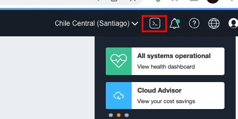
- Download the release given by your Oracle for Startups Architect
- To upload the release into Cloud Shell, click on the icon depicted in the image below: 
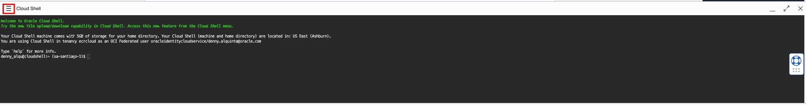
- Click in the *Upload* button
 
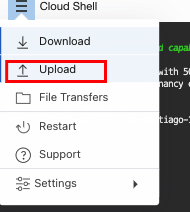
- Select the release you want to upload, clicking on *select from your computer* and then click *Upload*

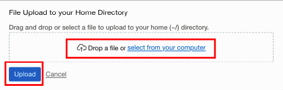

- Unzip the file 
- Execute the script `fireup.sh`
- Once ran, deliver the `reports.tar.gz` file to your Oracle for Startups Architect for review. To get this file:
  - Click in the hamburger menu and then in *Download*

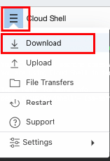

  - Type in `reports.tar.gz` and hit *Download*

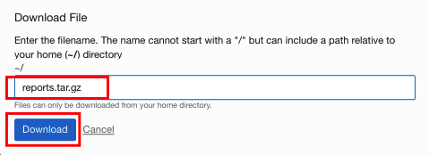

   - A screen like this will appear

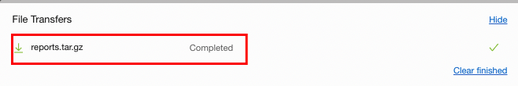


<div id="UsingJumpServer"></div>

### If using Jump Server
- Create a jump server into your tenancy. The supported Operative Systems are: 
    - `Oracle Linux 7.x`
    - `Oracle Linux 8.x`
    - `Oracle Autonomous Linux`
    - `Ubuntu 20.x`   

For this example, the machine `ol7example` has been created

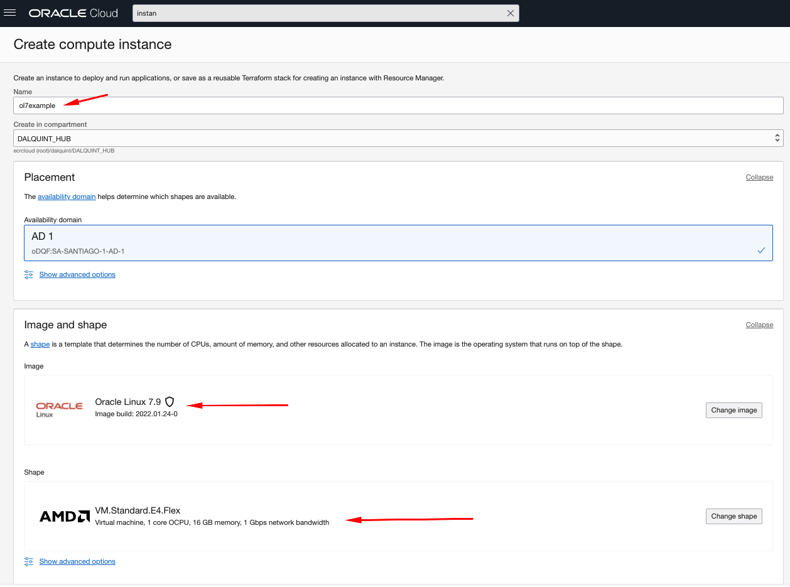

- Download the release given by your Oracle for Startups Architect and upload it into the jump server


```shell
[opc@ol7example ~]$ ls
fireup-1.0.0.zip
```

- Unzip the file

```shell
[opc@ol7example ~]$ unzip fireup-1.0.0.zip
```

- Execute the script `fireup.sh`

> :bulb: 
> 
> **Once ran for the first time, something like this should appear**
> ```shell
>[opc@ol7example fireup-1.0.0]$ ./fireup.sh 
>============== CLI Pre-Requisites ==============
>Installing OCI CLI in RedHat or CentOS...
>--2022-02-17 15:15:04--  https://raw.githubusercontent.com/oracle/oci-cli/master/>scripts/install/install.sh
>Resolving raw.githubusercontent.com (raw.githubusercontent.com)... 185.199.110.133, >185.199.111.133, 185.199.108.133, ...
>Connecting to raw.githubusercontent.com (raw.githubusercontent.com)|185.199.110.133|>:443... connected.
>HTTP request sent, awaiting response... 200 OK
>Length: 16641 (16K) [text/plain]
>Saving to: ‘install.sh’
>
>100%>[====================================================================================>==============================================================================>] 16,>641      --.-K/s   in 0s      
>
>2022-02-17 15:15:05 (67.8 MB/s) - ‘install.sh’ saved [16641/16641]
>
>Running with --accept-all-defaults
>Downloading Oracle Cloud Infrastructure CLI install script from https://raw.>githubusercontent.com/oracle/oci-cli/v3.2.1/scripts/install/install.py to /tmp/>oci_cli_install_tmp_qRZg.
>######################################################################## 100.0%
>Running install script.
>python3 /tmp/oci_cli_install_tmp_qRZg  --install-dir /home/opc/oci_cli/lib/>oracle-cli --exec-dir /home/opc/oci_cli/bin --accept-all-defaults
>-- Verifying Python version.
>-- Python version 3.6.8 okay.
>-- Creating directory '/home/opc/oci_cli/lib/oracle-cli'.
>-- Creating directory '/home/opc/oci_cli/bin'.
>-- Creating directory '/home/opc/bin/oci-cli-scripts'.
>-- The scripts will be in '/home/opc/bin/oci-cli-scripts'.
>-- The optional packages installed will be ''.
>-- Trying to use python3 venv.
>-- Executing: ['/bin/python3', '-m', 'venv', '/home/opc/oci_cli/lib/oracle-cli']
>-- Executing: ['/home/opc/oci_cli/lib/oracle-cli/bin/pip', 'install', '--upgrade', >'pip']
>Collecting pip
>  Downloading https://files.pythonhosted.org/packages/a4/6d/>6463d49a933f547439d6b5b98b46af8742cc03ae83543e4d7688c2420f8b/pip-21.3.>1-py3-none-any.whl (1.7MB)
>    100% |████████████████████████████████| 1.7MB 998kB/s 
>Installing collected packages: pip
>  Found existing installation: pip 9.0.3
>    Uninstalling pip-9.0.3:
>      Successfully uninstalled pip-9.0.3
>Successfully installed pip-21.3.1
>You are using pip version 21.3.1, however version 22.0.3 is available.
>You should consider upgrading via the 'pip install --upgrade pip' command.
>-- Executing: ['/home/opc/oci_cli/lib/oracle-cli/bin/pip', 'install', '--cache-dir', >'/tmp/tmpzv35o_xz', 'wheel', '--upgrade']
>Collecting wheel
>  Downloading wheel-0.37.1-py2.py3-none-any.whl (35 kB)
>Installing collected packages: wheel
>Successfully installed wheel-0.37.1
>-- Executing: ['/home/opc/oci_cli/lib/oracle-cli/bin/pip', 'install', '--cache-dir', >'/tmp/tmpzv35o_xz', 'oci_cli', '--upgrade']
>Collecting oci_cli
>  Downloading oci_cli-3.5.1-py3-none-any.whl (25.6 MB)
>     |████████████████████████████████| 25.6 MB 25.0 MB/s            
>Collecting click==7.1.2
>  Downloading click-7.1.2-py2.py3-none-any.whl (82 kB)
>     |████████████████████████████████| 82 kB 2.1 MB/s     
> ...
> ...
> ...
>  ****************************************************************** CALL TO ACTION ******************************************************************
>  Please finish the configuration of file ~/.oci/config 
>  Follow this documentation to finish the CLI configuration: https://docs.oracle.com/en-us/iaas/Content/API/Concepts/sdkconfig.htm#File_Entries
>  A correct configuration file at ~/.oci/config looks like this:
>
>     [DEFAULT]
>     region = us-ashburn-1
>     tenancy = ocid1.tenancy.oc1..aaaaaaaaw7e6nkszrry6d5hxxxxxxxxxxxxxxxxxxxxxxxxxxxxxxxxxxxxx
>     user = ocid1.user.oc1..aaaaaaaayblfepjieoxxxxxxxxxxxxxxxxxxxxxxxxxxxxxxxxxxxxxxxxxxxxx
>     fingerprint = 19:1d:7b:3a:17
>     key_file = ~/.oci/oci_api_key.pem
>     
>
> Once file is created, run command: chmod 600 ~/.oci/oci_api_key.pem and run ./fireup.sh script again. 
>  
>  ****************************************************************** CALL TO ACTION ******************************************************************
>
> ```

- This means that the CLI is not yet configured. To finish the configuration, go to the user designated for use fireup (it can be an admin user) and configure its API Token. Follow these documentation to create it: 
  
    - [Config File Location](https://docs.oracle.com/en-us/iaas/Content/API/Concepts/sdkconfig.htm#File_Name_and_Location)
    - [Config File Contents](https://docs.oracle.com/en-us/iaas/Content/API/Concepts/sdkconfig.htm#File_Entries)

- The content of `~/.oci/config` file can be obtained from here once the API Token is created: 

  - Go to the upper right corner of the page and click on the *User* icon.
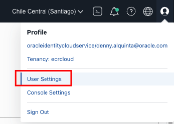

  - Click on the *API Keys* link.
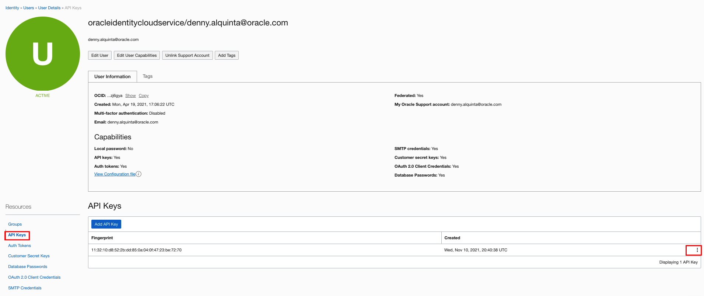

  - Click on the *triple dot* icon on the right part of the screen of an already configured API Key. If you haven't configured one yet, proceed to do it. Then click on "View Configuration File"
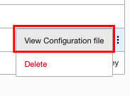

  - Click on the *Copy* link
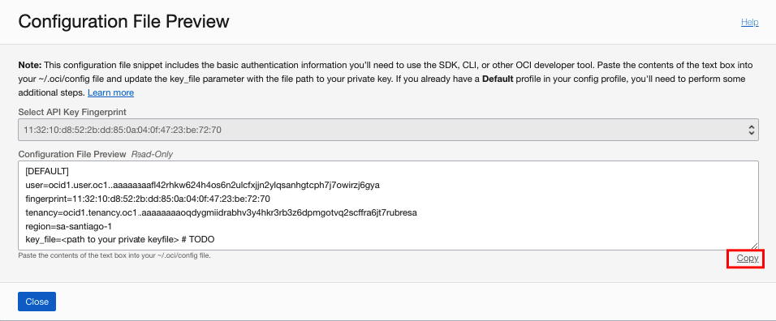

- Paste the contents on file `~/.oci/config`
- Be sure to complete the configuration by filling the line, with the private API Key associated to this user: 

```shell
key_file=<path to your private keyfile> # TODO
```

- Re-run `./fireup.sh` script and wait for it's completion. A progress bar is shown on the left part of the screen. Depending on the compute power of the jump server, this can take up to 20 minutes. 
- Once ran, deliver the `reports.tar.gz` file to your Oracle for Startups Architect for review

<div id="ExpectedOutput"></div>

## Expected output on console

```shell
######################################################################################################################################################################################################################################
#                                                                                                       FireUp Scanner v1.0.0                                                                                                      #
######################################################################################################################################################################################################################################
% Completion            RP    Area                                     Sub-Area                                                               OK   Findings   Review Point                                      
######################################################################################################################################################################################################################################
  2%|▏          | 1/52  1.1   Security and Compliance                  Manage Identities and Authorization Policies                           No   48         Enforce the Use of Multi-Factor Authentication (MFA)
  4%|▍          | 2/52  1.2   Security and Compliance                  Manage Identities and Authorization Policies                           Ok   0          Don't Use the Tenancy Administrator Account for Day-to-Day Operations
  6%|▌          | 3/52  1.3   Security and Compliance                  Manage Identities and Authorization Policies                           No   0          Restrict the Admin Abilities of a Tenancy Administrators Group
  8%|▊          | 4/52  1.4   Security and Compliance                  Manage Identities and Authorization Policies                           No   0          Prevent Accidental or Malicious Deletion of (and Changes to) Access Policies
 10%|▉          | 5/52  1.5   Security and Compliance                  Manage Identities and Authorization Policies                           No   25         Federate Oracle Cloud Infrastructure Identity and Access Management
 12%|█▏         | 6/52  1.6   Security and Compliance                  Manage Identities and Authorization Policies                           No   20         Monitor and Manage the Activities and Status of All Users
 13%|█▎         | 7/52  1.7   Security and Compliance                  Isolate Resources and Control Access                                   No   221        Organize Resources Using Compartments and Tags    
 15%|█▌         | 8/52  1.8   Security and Compliance                  Isolate Resources and Control Access                                   No   155        Implement Role-Based Access Control               
 17%|█▋         | 9/52  1.9   Security and Compliance                  Isolate Resources and Control Access                                   No   83         Secure Cross-Resource Access                      
 19%|█▉         | 10/52 1.10  Security and Compliance                  Isolate Resources and Control Access                                   No   155        Isolate Resources at the Network Layer            
 21%|██         | 11/52 1.11  Security and Compliance                  Isolate Resources and Control Access                                   No   158        Define Maximum Security Zones                     
 23%|██▎        | 12/52 1.12  Security and Compliance                  Secure Your Databases                                                  No   7          Control User and Network Access                   
 25%|██▌        | 13/52 1.13  Security and Compliance                  Secure Your Databases                                                  No   0          Restrict Permissions for Deleting Database Resources
 27%|██▋        | 14/52 1.14  Security and Compliance                  Secure your Databases                                                  No   3          Encrypt Data                                      
 29%|██▉        | 15/52 1.15  Security and Compliance                  Secure your Databases                                                  No   1          Apply Security Patches                            
 31%|███        | 16/52 1.16  Security and Compliance                  Secure Your Databases                                                  No   4          Enable Private Endpoints for Autonomous Databases 
 33%|███▎       | 17/52 1.17  Security and Compliance                  Protect Data at Rest                                                   No   65         Restrict Permissions for Deleting Storage Resources
...
...
...

```


___

<div id="Credits"></div>

## Credits

Refer to the following file for [credits and acknowledgements](AUTHORS.md)


<div id="Contributing"></div>

## Contributing
This project is open source.  Please submit your contributions by forking this repository and submitting a pull request!  Oracle appreciates any contributions that are made by the open source community.
For rules in how to contribute, refer to the [following link](COLLABORATE.md)


<div id="License"></div>

## License
Copyright (c) 2022 Oracle and/or its affiliates.

Licensed under the Universal Permissive License (UPL), Version 1.0.

See [LICENSE](LICENSE) for more details.


