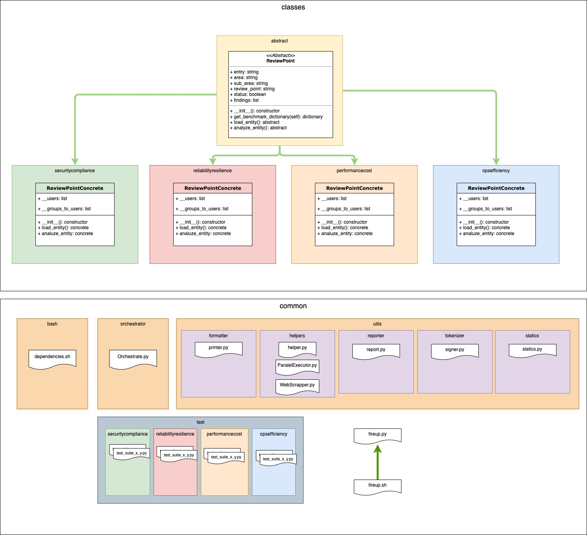

# FireUp Scanner
Fireup automated gathering and check tool

[](https://img.shields.io/badge/license-UPL-green) 
[](https://img.shields.io/github/downloads/oraclecloudbricks/fireup/total.svg)


# Table of Contents

- [FireUp Scanner](#fireup-scanner)
- [Table of Contents](#table-of-contents)
  - [Introduction](#introduction)
  - [Class Structure](#class-structure)
  - [Pre-requisites](#pre-requisites)
  - [How to use](#how-to-use)
  - [Expected output on console](#expected-output-on-console)
  - [Credits](#credits)
  - [Contributing](#contributing)
  - [License](#license)


<div id="Introduction"></div>

## Introduction

The following tool allows to make an automated analysis of Fireup keypoints, based on Architecture Best Practice Framework Documented under the [following link](https://docs.oracle.com/en/solutions/oci-best-practices/)

The check is currently spread in 4 major areas

- Security and Compliance
- Reliability and Resilience
- Performance and Cost Optimization
- Operational Efficiency

The following is the detail of areas of interest

| Business Goal                     | Key Focus Areas                                                                                                               |
|-----------------------------------|-------------------------------------------------------------------------------------------------------------------------------|
| Security and compliance           | User authentication                                                                                                           |
|                                   | Resource isolation and access control                                                                                         |
|                                   | Compute security                                                                                                              |
|                                   | Database security                                                                                                             |
|                                   | Data protection                                                                                                               |
|                                   | Network security                                                                                                              |
| Reliability and resilience        | Fault-tolerant network architecture                                                                                           |
|                                   | Service limits and quotas                                                                                                     |
|                                   | Data backup                                                                                                                   |
|                                   | Scaling                                                                                                                       |
| Performance and cost optimization | Compute sizing                                                                                                                |
|                                   | Storage strategy                                                                                                              |
|                                   | Network monitoring and tuning                                                                                                 |
|                                   | Cost tracking and management                                                                                                  |
| Operational efficiency            | Deployment strategy                                                                                                           |
|                                   | Workload monitoring                                                                                                           |
|                                   | OS management                                                                                                                 |
|                                   | Support                                                                                                                       |


<div id="ClassStructure"></div>

## Class Structure

The following is the class structure applied to the Fireup Tool



The following design patterns are applied to this project: 

- [Abstract Factory Pattern](https://en.wikipedia.org/wiki/Abstract_factory_pattern)
- [Iterator Pattern](https://en.wikipedia.org/wiki/Iterator_pattern)
- [Decorator Pattern](https://en.wikipedia.org/wiki/Decorator_pattern)

___

<div id="PreReqs"></div>

## Pre-requisites
- Pre-created Oracle Linux 7.9+ operative system to run the tool
- Python3 pre-installed
- Pre-configured Oracle Cloud Infrastructure (OCI) account
- CLI will be automatically installed if not present on the jump system. Make sure to complete the configuration of the CLI by filling the contents of the file `~/.oci/config` accordingly 
  - For more details, refer to the following links:  
    - [Manual and Offline Installations](https://docs.oracle.com/en-us/iaas/Content/API/SDKDocs/climanualinst.htm)
    - [Config File Location](https://docs.oracle.com/en-us/iaas/Content/API/Concepts/sdkconfig.htm#File_Name_and_Location)
    - [Config File Contents](https://docs.oracle.com/en-us/iaas/Content/API/Concepts/sdkconfig.htm#File_Entries)


<div id="HowToUse"></div>

## How to use

- Download the release given by your Oracle for Startups Architect
- Unzip the file 
- Execute the script `fireup.sh`
- Once ran, deliver the `reports.tar.gz` file to your Oracle for Startups Architect for review

<div id="ExpectedOutput"></div>

## Expected output on console

```shell
######################################################################################################################################################################################################################################
#                                                                                                       FireUp Scanner v1.0.0                                                                                                      #
######################################################################################################################################################################################################################################
% Completion            RP    Area                                     Sub-Area                                                               OK   Findings   Review Point                                      
######################################################################################################################################################################################################################################
  2%|▏          | 1/52  1.1   Security and Compliance                  Manage Identities and Authorization Policies                           No   48         Enforce the Use of Multi-Factor Authentication (MFA)
  4%|▍          | 2/52  1.2   Security and Compliance                  Manage Identities and Authorization Policies                           Ok   0          Don't Use the Tenancy Administrator Account for Day-to-Day Operations
  6%|▌          | 3/52  1.3   Security and Compliance                  Manage Identities and Authorization Policies                           No   0          Restrict the Admin Abilities of a Tenancy Administrators Group
  8%|▊          | 4/52  1.4   Security and Compliance                  Manage Identities and Authorization Policies                           No   0          Prevent Accidental or Malicious Deletion of (and Changes to) Access Policies
 10%|▉          | 5/52  1.5   Security and Compliance                  Manage Identities and Authorization Policies                           No   25         Federate Oracle Cloud Infrastructure Identity and Access Management
 12%|█▏         | 6/52  1.6   Security and Compliance                  Manage Identities and Authorization Policies                           No   20         Monitor and Manage the Activities and Status of All Users
 13%|█▎         | 7/52  1.7   Security and Compliance                  Isolate Resources and Control Access                                   No   221        Organize Resources Using Compartments and Tags    
 15%|█▌         | 8/52  1.8   Security and Compliance                  Isolate Resources and Control Access                                   No   155        Implement Role-Based Access Control               
 17%|█▋         | 9/52  1.9   Security and Compliance                  Isolate Resources and Control Access                                   No   83         Secure Cross-Resource Access                      
 19%|█▉         | 10/52 1.10  Security and Compliance                  Isolate Resources and Control Access                                   No   155        Isolate Resources at the Network Layer            
 21%|██         | 11/52 1.11  Security and Compliance                  Isolate Resources and Control Access                                   No   158        Define Maximum Security Zones                     
 23%|██▎        | 12/52 1.12  Security and Compliance                  Secure Your Databases                                                  No   7          Control User and Network Access                   
 25%|██▌        | 13/52 1.13  Security and Compliance                  Secure Your Databases                                                  No   0          Restrict Permissions for Deleting Database Resources
 27%|██▋        | 14/52 1.14  Security and Compliance                  Secure your Databases                                                  No   3          Encrypt Data                                      
 29%|██▉        | 15/52 1.15  Security and Compliance                  Secure your Databases                                                  No   1          Apply Security Patches                            
 31%|███        | 16/52 1.16  Security and Compliance                  Secure Your Databases                                                  No   4          Enable Private Endpoints for Autonomous Databases 
 33%|███▎       | 17/52 1.17  Security and Compliance                  Protect Data at Rest                                                   No   65         Restrict Permissions for Deleting Storage Resources
...
...
...

```


___

<div id="Credits"></div>

## Credits

Refer to the following file for [credits and acknowledgements](AUTHORS.md)


<div id="Contributing"></div>

## Contributing
This project is open source.  Please submit your contributions by forking this repository and submitting a pull request!  Oracle appreciates any contributions that are made by the open source community.
For rules in how to contribute, refer to the [following link](COLLABORATE.md)


<div id="License"></div>

## License
Copyright (c) 2021 Oracle and/or its affiliates.

Licensed under the Universal Permissive License (UPL), Version 1.0.

See [LICENSE](LICENSE) for more details.


